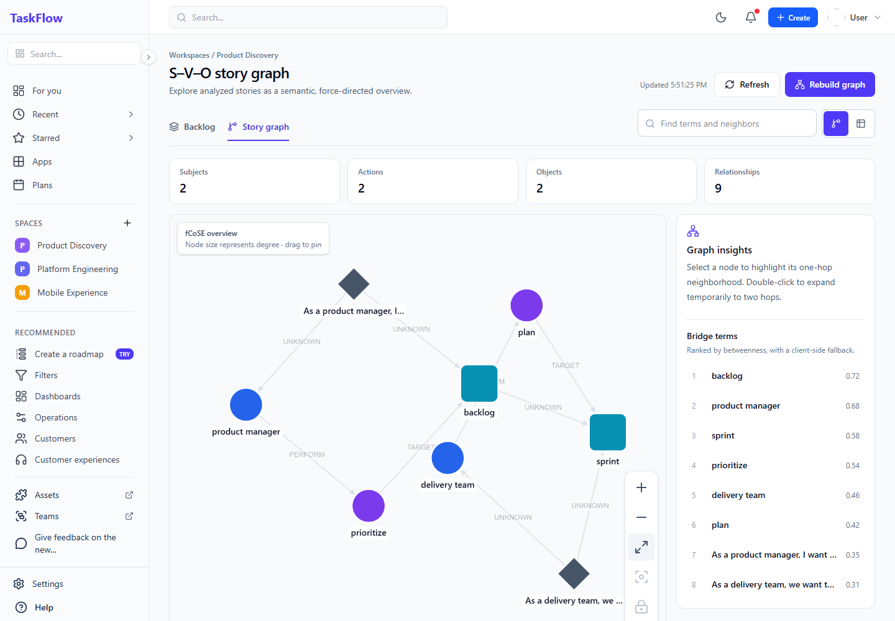
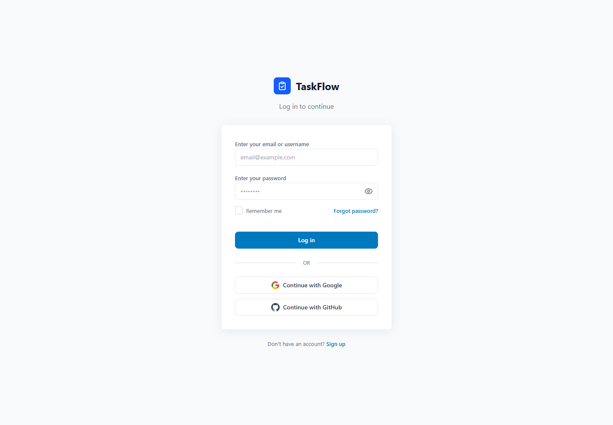
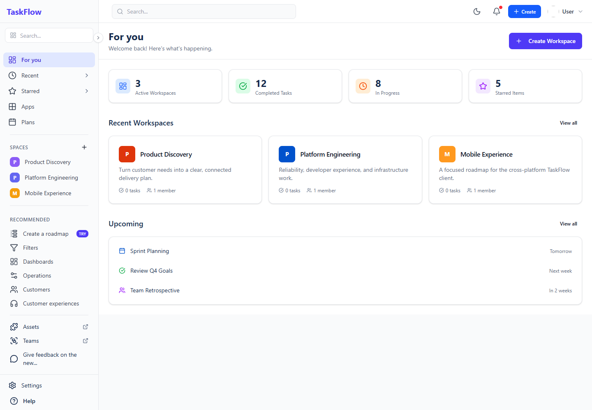
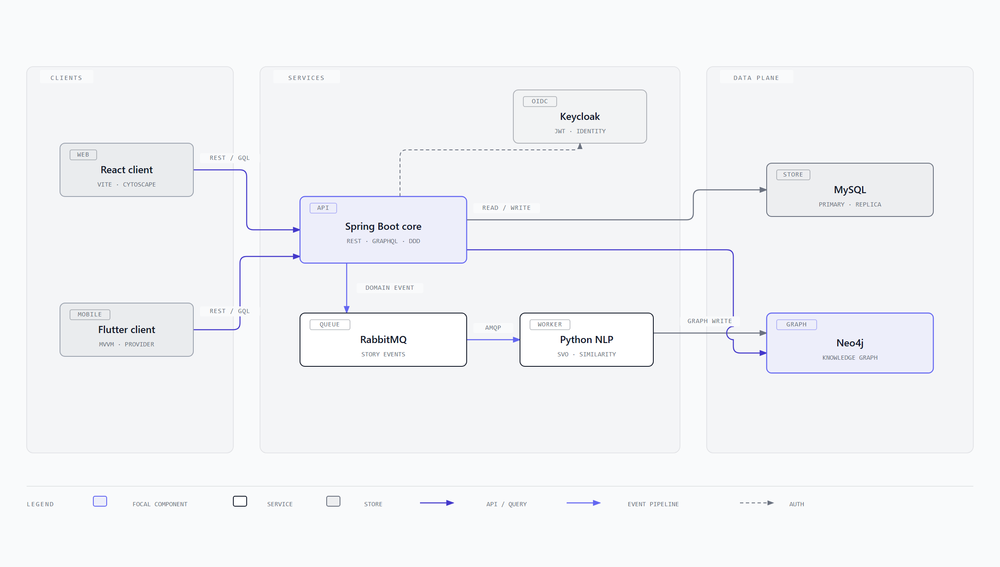

# TaskFlow

> An open research prototype for planning Agile work, understanding dependencies between user stories, and keeping teams aligned in real time.


TaskFlow combines familiar workspace, backlog, and sprint workflows with a knowledge graph built from user-story language. Teams can organize delivery work while exploring subject–verb–object relationships, potential redundancy, and dependencies across stories.

This repository is under active development. It is a good fit for contributors interested in Agile tooling, domain-driven design, graph visualization, event-driven systems, or applied NLP.

## Product tour



<table>
  <tr>
    <td width="50%"></td>
    <td width="50%"></td>
  </tr>
  <tr>
    <td align="center"><strong>Secure sign-in</strong></td>
    <td align="center"><strong>Workspace overview</strong></td>
  </tr>
</table>

<sub>Captured from the real React client with deterministic local API fixtures. To refresh the gallery, run <code>npm run dev</code> and <code>npm run screenshots</code> from <code>fe_web/react-web</code>; a local Chrome installation is required.</sub>

## Why TaskFlow?

- **Plan together** — create workspaces, invite members, manage backlogs, and run sprints.
- **See hidden relationships** — turn user stories into an interactive S–V–O knowledge graph.
- **Keep analysis off the request path** — publish story events through RabbitMQ and process them asynchronously.
- **Model access explicitly** — combine workspace roles with resource-level grants.
- **Build on multiple clients** — use the React web app or the Flutter client against the same API.

## Architecture at a glance

The main request path runs through the modular Spring Boot API. User-story changes are persisted in MySQL and published to RabbitMQ; the Python worker performs NLP analysis and updates Neo4j. Clients query the resulting graph through the backend GraphQL endpoint.



[Open the full architecture diagram](docs/architecture-overview.html) — a self-contained, accessible HTML/SVG document that can be viewed locally in any modern browser.

| Area | Technology | Responsibility |
| --- | --- | --- |
| Web client | React 19, TypeScript, Vite, Cytoscape | Workspace UI, sprint/backlog flows, interactive graph exploration |
| Cross-platform client | Flutter, Provider/MVVM | Mobile and desktop client experiments |
| Core API | Java 21, Spring Boot, Maven | REST/GraphQL APIs, domain rules, authorization, events, background jobs |
| Identity | Keycloak, OAuth 2.0/OIDC | Authentication and JWT issuance |
| Operational data | MySQL primary/replica, Redis | Transactional storage, read routing, and caching |
| Knowledge graph | Neo4j + Graph Data Science | Story concepts, relationships, and graph queries |
| Analysis pipeline | FastAPI, spaCy, Gensim, sentence-transformers | Parsing, semantic normalization, similarity, and graph construction |
| Messaging | RabbitMQ | Durable handoff of story-created and story-moved events |

The backend follows a modular DDD-style dependency direction:

```text
nckh-controller → nckh-application → nckh-domain
        │                 ↑
        └──── nckh-infrastructure ──── external systems
```

## Repository map

```text
taskflow/
├── be/nckh/                 # Multi-module Spring Boot backend
├── fe_web/react-web/        # Primary React web client
├── analyze_user_stories/    # Python NLP and knowledge-graph worker
├── frontend-mvvm/           # Flutter MVVM client
├── frontend/                # Earlier Flutter client
└── docs/                    # Project diagrams and supporting documentation
```

## Quick start

TaskFlow is a distributed development stack. For the shortest first contribution, run and test the component you plan to change. A full local environment additionally needs Docker services and Keycloak configuration.

### 1. Clone the repository

```bash
git clone https://github.com/DucHuy74/taskflow.git
cd taskflow
```

### 2. Start the React client

Requirements: Node.js 22.12+ and npm.

```bash
cd fe_web/react-web
cp .env.example .env
npm install
npm run dev
```

The app is served at `http://localhost:5173`. By default it expects the API at `http://localhost:8080/api` and Keycloak at `http://localhost:8180`.

Useful frontend commands:

```bash
npm run build       # Type-check and create a production build
npm run lint        # Run Oxlint
npm run test:run    # Run unit tests once
npx playwright test # Run end-to-end tests
```

### 3. Start local infrastructure

Each dependency currently has its own Compose file:

```bash
docker compose -f be/nckh/mysql-replication/docker-compose.yml up -d
docker compose -f be/nckh/redis/docker-compose.yml up -d
docker compose -f be/nckh/rabbitmq/docker-compose.yml up -d
docker compose -f be/nckh/neo4j/docker-compose.yml up -d
```

Start Keycloak for local development:

```bash
docker run -d --name taskflow-keycloak -p 8180:8080 \
  -e KEYCLOAK_ADMIN=admin \
  -e KEYCLOAK_ADMIN_PASSWORD=admin \
  quay.io/keycloak/keycloak:25.0.0 start-dev
```

In Keycloak, create the `nckh` realm and an `nckh_app` client that matches your local redirect URLs. The repository does not yet ship a realm export, so this step is manual.

> The Compose credentials are development defaults only. Replace them before using TaskFlow outside a local machine.

### 4. Run the backend

Requirements: JDK 21 and Maven 3.9+.

The backend reads its configuration from `be/nckh/.env`. Create that file locally and provide the variables referenced by [`application.yml`](be/nckh/nckh-start/src/main/resources/application.yml), including the MySQL primary/replica, Redis, RabbitMQ, Neo4j, mail, and Keycloak settings.

```bash
cd be/nckh
mvn test
mvn -pl nckh-start -am spring-boot:run
```

With `SERVER_PORT=8080` and `SERVER_CONTEXT_PATH=/api`, the API is available at `http://localhost:8080/api`; GraphQL is available at `http://localhost:8080/api/graphql`.

### 5. Run the analysis service (optional)

The Python service is needed for NLP enrichment and knowledge-graph updates, but not for every frontend or domain contribution. It expects Python 3, MySQL, Neo4j, RabbitMQ, and a local word-vector model configured through `analyze_user_stories/.env`.

```bash
cd analyze_user_stories
python -m venv .venv
source .venv/bin/activate          # Windows: .venv\Scripts\activate
pip install -r requirements.txt
uvicorn main:app --reload
```

Run the RabbitMQ consumer in a second terminal:

```bash
cd analyze_user_stories
python -m src.messaging.consumer
```

Large NLP model files are intentionally not stored in Git. Configure or download the required model locally before starting the service.

## Core workflows

1. A user signs in through Keycloak and opens a workspace.
2. The client manages workspace members, backlog items, and sprint state through REST endpoints.
3. The backend persists transactional data and emits domain events after a successful commit.
4. The Python worker consumes story events, extracts semantic relationships, and writes the knowledge graph.
5. The client requests graph data through GraphQL and renders it with Cytoscape.

## Testing

Run checks close to the code you changed:

```bash
# Java domain and integration tests
cd be/nckh && mvn test

# React unit tests and production build
cd fe_web/react-web && npm run test:run && npm run build

# Python tests
cd analyze_user_stories && pytest

# Flutter tests
cd frontend-mvvm && flutter test
```

Some integration and end-to-end tests require the local services described above.

## Contributing

Contributions are welcome. A focused pull request is the easiest to review:

1. Fork the repository and branch from `main`.
2. Keep changes inside one bounded concern when possible.
3. Add or update tests for behavior changes.
4. Run the relevant formatter, tests, and build locally.
5. Explain the user impact and any setup changes in the pull request.

Good first contribution areas include setup automation, a reproducible Keycloak realm export, API documentation, test coverage, accessibility, and smaller graph-visualization improvements.

## Project status

TaskFlow is an active academic/research project rather than a production-ready hosted service. APIs, local setup, and data models may still change. Issues and pull requests that improve reproducibility and developer experience are especially valuable.

---

Built for teams who want to understand the work behind the board—not only move cards across it.
