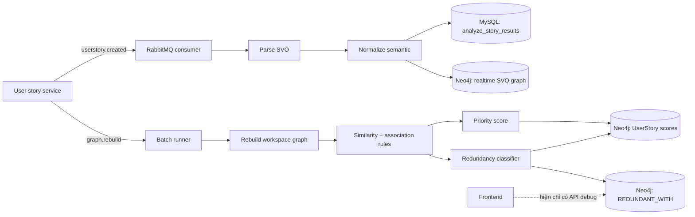

# Rà soát recommendation và hướng tích hợp frontend

## 1. Mục tiêu và kết luận ngắn

Codebase hiện đã có nền tảng để sinh tín hiệu gợi ý, nhưng chưa có một **recommendation feature hoàn chỉnh** cho frontend.

Hệ thống đang làm được ba việc chính:

1. Phân tích user story thành `subject - action - object` (SVO).
2. Tạo knowledge graph, tính độ quan trọng và xác suất trùng lặp.
3. Ghi các điểm số và quan hệ vào Neo4j.

Phần còn thiếu là lớp sản phẩm nằm giữa thuật toán và UI:

- chưa có recommendation entity ổn định;
- chưa có API phục vụ FE ngoài endpoint debug;
- chưa có lý do giải thích, trạng thái xử lý và lịch sử quyết định;
- chưa có contract cho thao tác `merge`, `keep separate`, `dismiss`;
- chưa có trạng thái job để FE biết lúc nào kết quả batch đã sẵn sàng.

Hướng tối ưu là:

- tách riêng **độ ưu tiên nghiệp vụ** và **khả năng trùng lặp**;
- dùng model hiện tại để xếp hạng ứng viên cần review, không tự động xóa/gộp;
- bổ sung recommendation API có explainability và audit trail;
- để FE hiển thị theo luồng review có xác nhận của BA/Product Owner;
- dùng feedback thật từ người dùng làm nhãn huấn luyện ở giai đoạn sau.

---

## 2. Phạm vi đã rà soát

Đã rà soát các thành phần chạy thực tế và phần thử nghiệm liên quan:

- FastAPI entrypoint, route và request model;
- RabbitMQ consumer cho create/move và batch rebuild;
- chuỗi parser `standard -> generic -> Word2Vec fallback`;
- semantic normalization, Apriori association rules;
- graph realtime, graph batch, Neo4j queries và write lock;
- priority scoring và redundancy classification;
- SQLAlchemy models, repositories, migration;
- model loader, similarity strategies và grid search;
- unit test hiện có, Dockerfile và cấu hình chạy.

Các file dataset trong `experiment/dataset` là dữ liệu benchmark, không phải logic runtime. Luồng load và sử dụng các dataset đã được kiểm tra qua code experiment.

---

## 3. Kiến trúc hiện tại



### Luồng realtime

`src/messaging/consumer.py` nhận:

- `userstory.created`: parse, lưu kết quả phân tích vào MySQL, ghi SVO vào Neo4j;
- `userstory.moved`: cập nhật sprint/backlog trong MySQL và trên quan hệ Neo4j.

Realtime chỉ cập nhật graph cơ bản. Nó chưa tính lại recommendation hoàn chỉnh.

### Luồng batch

`src/messaging/batch_runner.py` nhận event `REBUILD_GRAPH`, sau đó `GraphBatchService`:

1. đọc toàn bộ kết quả SVO của workspace từ MySQL;
2. chuẩn hóa action;
3. tạo association rules;
4. xóa và dựng lại phần graph của workspace;
5. tính centrality và priority ban đầu;
6. tạo mọi cặp story;
7. gán weak label, chọn baseline model, dự đoán redundancy;
8. tạo redundancy group;
9. tính priority cuối;
10. lưu score, edge và metrics vào Neo4j.

Batch bị bỏ qua nếu workspace có ít hơn 3 SVO hợp lệ.

---

## 4. “Recommend” hiện tại thực sự là gì?

Trong code không có class hay bảng tên `Recommendation`. Recommendation hiện tại là cách diễn giải các output sau.

### 4.1 Semantic normalization

`SemanticNormalizationService` chỉ so sánh các **action** khác nhau bằng hàm fusion:

```text
similarity = sigmoid(5.0 * word2vec + 1.3 * wordnet - 2.0)
```

Hai action được auto-merge khi:

```text
similarity >= 0.75 và context overlap >= 0.5
```

Nếu `similarity >= 0.6` nhưng chưa đủ auto-merge thì được đưa vào `ambiguous`. Tuy nhiên `ambiguous` hiện chưa được persist và chưa được expose ra API.

Lưu ý: class có khai báo `AUTO_MERGE_THRESHOLD = 0.8` và `REVIEW_THRESHOLD = 0.5`, nhưng logic thực tế lại hard-code `0.75` và `0.6`. Vì vậy hai constant này hiện không điều khiển hành vi.

### 4.2 Priority ban đầu

`PriorityService` tính degree và betweenness của các `Term` trong workspace. Với từng story:

```text
structural_score = 0.5 * average_degree + 0.5 * average_betweenness
priority_initial = sigmoid(alpha * structural_score + beta)
```

`alpha` và `beta` được suy ra từ median/IQR của chính workspace. Khi IQR bằng 0, các story bằng nhau thường hội tụ về mức gần `0.5`.

Đây là **độ trung tâm trong graph**, chưa phải business priority theo value, urgency, risk, effort hay deadline.

### 4.3 Redundancy score

Mỗi cặp story có các feature:

- cùng subject/action/object;
- action similarity;
- object similarity;
- association-rule confidence/lift;
- chênh lệch priority.

Weak label dương yêu cầu similarity/rule đạt ngưỡng. Weak label âm yêu cầu cả action và object gần như không giống nhau. Các cặp còn lại không có nhãn.

Nếu có đủ hai class, ba model được thử:

- Logistic Regression;
- Random Forest;
- Histogram Gradient Boosting.

Model có F1 cho class redundant cao nhất trên split 70/30 được chọn. Nếu không huấn luyện được, hệ thống dùng công thức fallback:

```text
redundancy_prob =
    0.35 * object_similarity
  + 0.20 * action_similarity
  + 0.15 * same_object
  + 0.15 * rule_confidence
  + 0.15 * same_action
```

Một cặp được đánh dấu redundant khi `redundancy_prob >= REDUNDANCY_THRESHOLD`, mặc định là `0.6`.

### 4.4 Priority cuối

Code hiện tại kết hợp các tín hiệu như sau:

```text
priority_refined =
    0.5 * priority_initial
  + 0.3 * similarity_signal
  + 0.2 * rule_signal

priority_final = priority_refined * (1 - 0.6 * redundancy_prob)
```

Kết quả được lưu trên node `UserStory`:

- `priority_refined`;
- `redundancy_prob`;
- `priority_final`;
- `redundancy_group_id`.

Các cặp được lưu dưới cạnh `REDUNDANT_WITH` với:

- `score`;
- `group_id`;
- `model`;
- `is_redundant`.

### 4.5 API hiện có

API liên quan duy nhất là:

```http
GET /analyze/debug/redundancy/{workspace_id}?top_k=20
```

Response chỉ có ID hai story, score, group và model. Nó không trả:

- nội dung story;
- `is_redundant`;
- các feature/lý do;
- action đề xuất;
- trạng thái đã review;
- thời điểm/model version;
- trạng thái batch.

Endpoint này phù hợp để debug, chưa phù hợp làm contract production cho FE.

---

## 5. Các vấn đề cần xử lý

### P0 — ảnh hưởng trực tiếp đến độ đúng

1. **Similarity map không đủ dữ liệu cho classifier.** Semantic service chỉ so sánh action và chỉ lưu cặp đã auto-merge. `object_similarity` trong pair dataset vì thế đa số bằng 0; các action có độ giống vừa phải cũng bị mất khỏi map.

2. **Weak supervision đang tự đánh giá chính nó.** Nhãn được sinh từ các feature rồi model lại học và được đánh giá trên chính loại nhãn đó. F1/PR-AUC hiện đo mức model bắt chước rule, không chứng minh model phát hiện duplicate thật.

3. **Association không đồng nghĩa redundancy.** Hai term thường đi cùng nhau có thể bổ sung cho nhau, không nhất thiết trùng nhau. `rule_confidence` và `rule_lift` không nên là điều kiện mạnh để kết luận duplicate.

4. **Priority và redundancy bị trộn ý nghĩa.** Story quan trọng nhưng bị trùng vẫn có thể mang business value cao. Giảm priority theo redundancy làm FE khó giải thích và có thể xếp hạng sai.

5. **Endpoint debug trả cả top pair dưới threshold nhưng không trả `is_redundant`.** FE không thể phân biệt candidate và kết luận classifier.

6. **Small dataset có thể làm batch lỗi.** Có hai class chưa đủ để `train_test_split(..., stratify=y)` luôn chạy được; mỗi class cần đủ mẫu cho cả train/test.

### P1 — độ ổn định và khả năng vận hành

1. Tạo toàn bộ cặp là `O(n²)`, không phù hợp workspace lớn.
2. Model được train lại theo từng workspace/mỗi rebuild nhưng không persist artifact, version hoặc calibration.
3. Score của ba model khác nhau không được calibration nên không thể mặc định coi đều là xác suất tương đương.
4. `group_1`, `group_2` phụ thuộc thứ tự dữ liệu, không phải ID ổn định giữa các lần rebuild.
5. Story không thuộc nhóm duplicate vẫn được cấp một group riêng, dễ khiến FE hiểu nhầm.
6. Các cặp top-K dưới threshold vẫn được lưu; `group_id` trên edge không có ý nghĩa rõ với cặp không redundant.
7. UserStory node cũ có thể còn lại sau rebuild vì `clear_workspace` xóa node có `workspace_id`, trong khi lifecycle và gán workspace của UserStory chưa nhất quán.
8. Graph GDS dùng tên chung `termGraph`; hai workspace rebuild song song có thể va chạm dù lock hiện được chia theo workspace.
9. `WorkspaceWriteLock.exclusive()` chưa chờ các shared holder hiện tại kết thúc, nên chưa phải read/write lock đầy đủ.
10. `AnalyzePersistenceService.update_context()` ghi `asr_backlog_id`, nhưng model `AnalyzeStoryResult` không khai báo cột này.

### P2 — contract và maintainability

1. Route `/learn` hard-code `SPRINT_1`, `WS_1`, `USER_1` và trả domain object thô.
2. Một số repository import từ `models.*` và tham chiếu `AnalyzeStory` không tồn tại trong cây source hiện tại.
3. Dockerfile chạy `app.py` nhưng entrypoint hiện có là `main.py`.
4. README hướng dẫn `uvicorn app.main:app`, không khớp cấu trúc repository.
5. `main.py` khởi tạo `DatabaseManager` thêm một lần ngoài instance đã tạo trong `src/database/db.py`.
6. Nhiều exception bị bắt quá rộng (`except:`), khiến lỗi dữ liệu/model bị bỏ qua mà không có telemetry rõ ràng.

---

## 6. Thiết kế recommendation tối ưu

### 6.1 Tách ba output độc lập

Không dùng một score duy nhất cho mọi quyết định.

| Output | Ý nghĩa | FE sử dụng |
|---|---|---|
| `businessPriorityScore` | Giá trị/độ cấp thiết của story | Sắp xếp backlog |
| `duplicateScore` | Mức giống giữa hai story | Đưa vào hàng chờ review |
| `recommendation` | Quy tắc diễn giải score và evidence | Hiển thị hành động có thể thực hiện |

`duplicateScore` không trực tiếp làm giảm `businessPriorityScore`. Nếu hai story được xác nhận trùng, hệ thống chọn một story đại diện rồi archive/link story còn lại theo quyết định của người dùng.

### 6.2 Pipeline đề xuất

#### Giai đoạn 1: deterministic + human-in-the-loop

Đây là phương án nên triển khai trước vì dễ giải thích và an toàn khi chưa có ground-truth label.

1. Parse và chuẩn hóa SVO như hiện tại.
2. Tạo embedding cho **toàn bộ câu user story**, không chỉ từng action.
3. Candidate retrieval bằng hai lớp:
   - exact block: cùng canonical object hoặc cùng canonical action;
   - semantic block: lấy top-K nearest neighbors theo sentence embedding.
4. Chấm điểm mỗi candidate bằng các tín hiệu độc lập:
   - full-text semantic similarity;
   - same/canonical action;
   - same/canonical object;
   - subject compatibility;
   - keyword/entity overlap;
   - parse confidence.
5. Sinh `reasonCodes` và evidence dễ hiểu.
6. Chỉ tạo recommendation để người có quyền review.
7. Lưu quyết định `MERGE`, `KEEP_SEPARATE`, `DEFER` làm nhãn thật.

Không dùng association rule làm feature chính của duplicate. Có thể giữ nó như evidence phụ cho quan hệ domain.

#### Giai đoạn 2: supervised ranking

Khi đã có đủ quyết định thật:

1. chia train/validation/test theo workspace hoặc theo thời gian để tránh leakage;
2. đo precision@K, recall, PR-AUC và tỷ lệ BA chấp nhận gợi ý;
3. calibration score trước khi hiển thị dưới dạng phần trăm;
4. version model, feature schema và threshold;
5. rollout shadow/canary trước khi thay policy đang chạy.

### 6.3 Policy hiển thị khởi điểm

Ngưỡng dưới đây là policy khởi điểm, cần hiệu chỉnh bằng dữ liệu thật:

| Band | Điều kiện gợi ý | Hành vi |
|---|---|---|
| High | score đã calibration `>= 0.85` hoặc match rule rất mạnh | Hiển thị “Nên xem xét gộp” |
| Medium | `0.65 <= score < 0.85` | Hiển thị “Có thể trùng, cần kiểm tra” |
| Low | `< 0.65` | Không làm phiền người dùng; chỉ dùng trong debug/analytics |

Ngay cả band High cũng không tự xóa story. Auto-merge chỉ nên được cân nhắc sau khi precision được chứng minh và nghiệp vụ cho phép undo.

### 6.4 Chọn story đại diện

Trong một duplicate group, story đại diện nên được chọn bằng rule có thể giải thích:

1. story đang active và không deleted;
2. story có parse completeness/confidence cao hơn;
3. story có business priority cao hơn;
4. story có acceptance criteria/metadata đầy đủ hơn;
5. nếu vẫn bằng nhau, chọn story tạo trước để ID ổn định.

Không dùng `priority_final` hiện tại làm tiêu chí duy nhất vì score này đã bị phạt bởi redundancy.

### 6.5 Lưu trữ

Neo4j phù hợp để lưu quan hệ và truy vấn neighborhood. Tuy nhiên trạng thái workflow cần audit nên lưu trong database quan hệ.

Đề xuất bảng `recommendations`:

```text
id
workspace_id
type                     # POSSIBLE_DUPLICATE | PRIORITY_HINT
status                   # OPEN | ACCEPTED | REJECTED | DEFERRED | STALE
left_story_id
right_story_id
group_key
score
confidence_band
reason_codes_json
evidence_json
suggested_action
model_version
source_revision
generated_at
reviewed_at
reviewed_by
decision_note
version                   # optimistic locking
```

Neo4j giữ score/edge kỹ thuật; MySQL giữ recommendation mà người dùng nhìn thấy và quyết định đã thực hiện.

---

## 7. API contract đề xuất cho frontend

Nên expose qua backend chính/BFF nếu hệ thống đã có gateway và authorization. FE không nên truy cập Neo4j hoặc endpoint debug trực tiếp.

### 7.1 Lấy danh sách recommendation

```http
GET /api/workspaces/{workspaceId}/recommendations
    ?type=POSSIBLE_DUPLICATE
    &status=OPEN
    &confidence=HIGH,MEDIUM
    &cursor=...
    &limit=20
```

Response:

```json
{
  "data": [
    {
      "id": "rec_01J...",
      "type": "POSSIBLE_DUPLICATE",
      "status": "OPEN",
      "confidence": {
        "band": "HIGH",
        "score": 0.91,
        "calibrated": true
      },
      "title": "Hai user story có thể mô tả cùng một nhu cầu",
      "stories": [
        {
          "id": "US-128",
          "text": "As a user, I want to reset my password...",
          "businessPriorityScore": 0.82,
          "parseConfidence": 1.0
        },
        {
          "id": "US-245",
          "text": "As a customer, I want to recover my password...",
          "businessPriorityScore": 0.71,
          "parseConfidence": 0.8
        }
      ],
      "evidence": [
        {
          "code": "SAME_CANONICAL_OBJECT",
          "label": "Cùng đối tượng: password"
        },
        {
          "code": "SEMANTIC_TEXT_SIMILARITY",
          "label": "Nội dung có độ tương đồng cao",
          "value": 0.93
        }
      ],
      "suggestedAction": {
        "type": "MERGE_REVIEW",
        "representativeStoryId": "US-128"
      },
      "modelVersion": "duplicate-ranker-1.0.0",
      "generatedAt": "2026-10-01T08:30:00Z",
      "version": 3
    }
  ],
  "page": {
    "nextCursor": null,
    "hasMore": false
  },
  "summary": {
    "open": 8,
    "high": 2,
    "medium": 6
  }
}
```

### 7.2 Ghi nhận quyết định

```http
POST /api/workspaces/{workspaceId}/recommendations/{recommendationId}/decision
Idempotency-Key: <uuid>
```

```json
{
  "decision": "KEEP_SEPARATE",
  "note": "Hai luồng reset dành cho hai loại tài khoản khác nhau",
  "version": 3
}
```

Các decision hợp lệ:

- `MERGE`;
- `KEEP_SEPARATE`;
- `DEFER`.

Backend phải kiểm tra quyền, workspace ownership, optimistic version và trả `409` nếu recommendation đã thay đổi.

### 7.3 Trạng thái phân tích

```http
GET /api/workspaces/{workspaceId}/recommendation-jobs/latest
```

```json
{
  "status": "RUNNING",
  "stage": "SCORING_CANDIDATES",
  "progress": 64,
  "startedAt": "2026-10-01T08:29:00Z",
  "lastSuccessfulRunAt": "2026-09-30T14:05:00Z"
}
```

Trạng thái tối thiểu: `QUEUED`, `RUNNING`, `SUCCEEDED`, `FAILED`. Nếu chưa có SSE/WebSocket, FE polling 3–5 giây khi job đang chạy và dừng ngay khi vào terminal state.

### 7.4 Error contract

```json
{
  "error": {
    "code": "RECOMMENDATION_VERSION_CONFLICT",
    "message": "Gợi ý đã được cập nhật bởi người dùng khác.",
    "requestId": "req_01J...",
    "details": {}
  }
}
```

Không trả stack trace hoặc exception text cho FE.

---

## 8. Cách áp dụng trên frontend

Phần ví dụ dùng TypeScript/React ở mức contract. Nếu FE dùng framework khác, giữ nguyên state machine và API shape.

### 8.1 Vị trí trong sản phẩm

Nên có hai điểm vào:

1. **Backlog header:** badge “8 gợi ý cần xem xét”.
2. **Recommendation review page/drawer:** danh sách các cặp, bộ lọc và vùng so sánh chi tiết.

Không nên chèn banner vào từng story ngay từ đầu vì dễ gây nhiễu và làm người dùng hiểu score là kết luận chắc chắn.

### 8.2 Bố cục review

Mỗi recommendation card/row hiển thị:

- nhãn `High confidence` hoặc `Needs review`;
- hai story đặt cạnh nhau;
- 2–3 lý do quan trọng nhất;
- story đại diện được đề xuất;
- ba action: `Gộp`, `Giữ riêng`, `Để sau`;
- link mở đầy đủ metadata của từng story.

Trên mobile, chuyển layout hai cột thành hai section xếp dọc. Nút thao tác tối thiểu 44×44px và không phụ thuộc hover.

### 8.3 Không hiển thị raw score như chân lý

Ưu tiên confidence band và diễn giải:

```text
High confidence
Cùng đối tượng “password” và nội dung rất giống nhau.
```

Chỉ hiển thị `91%` khi score đã calibration. Nếu chưa calibration, dùng nhãn `High/Medium` và tooltip “Mức tương đồng, không phải xác suất chắc chắn”.

### 8.4 TypeScript types

```ts
type RecommendationStatus =
  | "OPEN"
  | "ACCEPTED"
  | "REJECTED"
  | "DEFERRED"
  | "STALE";

type RecommendationDecision = "MERGE" | "KEEP_SEPARATE" | "DEFER";

type EvidenceCode =
  | "SAME_CANONICAL_ACTION"
  | "SAME_CANONICAL_OBJECT"
  | "SEMANTIC_TEXT_SIMILARITY"
  | "SUBJECT_COMPATIBILITY"
  | "LOW_PARSE_CONFIDENCE";

interface RecommendationStory {
  id: string;
  text: string;
  businessPriorityScore: number | null;
  parseConfidence: number | null;
}

interface DuplicateRecommendation {
  id: string;
  type: "POSSIBLE_DUPLICATE";
  status: RecommendationStatus;
  confidence: {
    band: "HIGH" | "MEDIUM";
    score: number;
    calibrated: boolean;
  };
  title: string;
  stories: [RecommendationStory, RecommendationStory];
  evidence: Array<{
    code: EvidenceCode;
    label: string;
    value?: number;
  }>;
  suggestedAction: {
    type: "MERGE_REVIEW";
    representativeStoryId: string;
  };
  generatedAt: string;
  modelVersion: string;
  version: number;
}
```

### 8.5 State machine của UI

```text
idle -> loading -> success
                -> empty
                -> error -> retrying

open recommendation -> submitting decision -> resolved
                                          -> conflict -> refresh detail
                                          -> error -> retry
```

Yêu cầu UX:

- dùng skeleton ổn định khi tải danh sách để tránh layout shift;
- đặt `aria-busy="true"` trên vùng đang refresh;
- disable đúng nút đang submit để chống double-submit;
- thông báo thành công ngắn gọn sau quyết định;
- lỗi phải có `role="alert"` và nút thử lại;
- giữ item trên màn hình ở trạng thái resolved trong thời gian ngắn hoặc có Undo, tránh biến mất đột ngột;
- hỗ trợ keyboard focus và focus không bị mất khi đóng drawer;
- không dùng màu làm tín hiệu confidence duy nhất.

### 8.6 Luồng fetch đề xuất

```ts
async function decideRecommendation(
  workspaceId: string,
  recommendation: DuplicateRecommendation,
  decision: RecommendationDecision,
  note?: string,
) {
  const response = await fetch(
    `/api/workspaces/${workspaceId}/recommendations/${recommendation.id}/decision`,
    {
      method: "POST",
      headers: {
        "Content-Type": "application/json",
        "Idempotency-Key": crypto.randomUUID(),
      },
      body: JSON.stringify({
        decision,
        note,
        version: recommendation.version,
      }),
    },
  );

  if (response.status === 409) {
    throw new Error("RECOMMENDATION_VERSION_CONFLICT");
  }

  if (!response.ok) {
    throw new Error("RECOMMENDATION_DECISION_FAILED");
  }

  return response.json();
}
```

Sau mutation, ưu tiên cập nhật cache theo response server rồi revalidate summary. Không tự đoán kết quả merge ở client.

### 8.7 Quyền và an toàn thao tác

- Viewer: chỉ xem recommendation.
- Editor/BA: `KEEP_SEPARATE`, `DEFER`.
- Product Owner/Admin: `MERGE` nếu merge làm thay đổi backlog thực.
- Merge phải có màn hình xác nhận nêu rõ story nào được giữ và dữ liệu nào được chuyển.
- Nếu merge là destructive, backend cần transaction hoặc saga và hỗ trợ undo/audit.

---

## 9. Kế hoạch triển khai theo thứ tự

### Phase 0 — sửa nền tảng hiện tại

- thống nhất threshold vào config, bỏ hard-code;
- trả `is_redundant` và evidence trong API nội bộ;
- xử lý small-sample trước khi stratified split;
- tách graph name theo workspace hoặc serialize toàn bộ GDS projection;
- sửa write lock để exclusive chờ shared count về 0;
- sửa schema/import/entrypoint/README đang lệch;
- thêm test cho priority, pair feature, threshold, group và Neo4j query contract.

### Phase 1 — recommendation MVP

- giữ classifier/rule-based scorer như candidate ranker;
- bổ sung bảng `recommendations` và `recommendation_decisions`;
- tạo API list/detail/decision/job status;
- enrich response bằng story text từ source-of-truth service;
- triển khai FE review queue với `MERGE`, `KEEP_SEPARATE`, `DEFER`;
- log acceptance rate, dismissal reason, latency và lỗi.

### Phase 2 — nâng chất lượng

- thêm full-sentence embedding;
- candidate blocking/ANN để bỏ `O(n²)`;
- bỏ association rule khỏi điều kiện chính của duplicate;
- tạo stable group key từ member IDs hoặc persisted group ID;
- calibration confidence và threshold theo dữ liệu thật.

### Phase 3 — supervised model

- train bằng decision của BA/Product Owner;
- đánh giá theo workspace/time split;
- model registry/versioning và shadow evaluation;
- chỉ cân nhắc auto-action khi precision và khả năng undo đạt tiêu chuẩn nghiệp vụ.

---

## 10. Tiêu chí hoàn thành MVP

Backend:

- không trả recommendation dưới threshold production;
- mỗi recommendation có story content, confidence band, reason codes và generated time;
- decision idempotent, có audit và optimistic locking;
- kết quả được scope tuyệt đối theo workspace;
- batch failure không làm mất recommendation thành công gần nhất;
- API có pagination và authorization;
- score/model version được lưu cùng recommendation.

Frontend:

- có loading, empty, error, stale và conflict state;
- có thể review hoàn toàn bằng keyboard;
- không dùng raw score chưa calibration như xác suất;
- người dùng luôn thấy lý do và hậu quả trước khi merge;
- có feedback sau mọi action và đường retry khi lỗi;
- summary count đồng bộ lại sau decision;
- responsive, không có horizontal scroll ngoài vùng so sánh được chủ động thiết kế.

Chất lượng recommendation:

- đo precision@K và acceptance rate thay vì chỉ F1 trên weak labels;
- theo dõi false-positive theo workspace/domain;
- có tập validation do con người gán nhãn;
- threshold được cấu hình, version hóa và có thể rollback.

---

## 11. File map khi bắt đầu triển khai

Các thay đổi backend nên được chia theo trách nhiệm:

```text
src/models/recommendation.py
src/repositories/recommendation_repository.py
src/services/recommendation_service.py
src/services/recommendation_policy.py
src/routes/recommendation_router.py
migrations/002_create_recommendations.sql
tests/test_recommendation_policy.py
tests/test_recommendation_api.py
```

Các file hiện tại cần refactor trực tiếp:

```text
src/services/semantic_normalization_service.py
src/services/redundancy_classification_service.py
src/services/graph_batch_service.py
src/services/neo4j_service.py
src/services/neo4j_write_lock.py
src/messaging/batch_runner.py
constant.py
main.py
README.md
Dockerfile
```

FE nên tách tối thiểu:

```text
features/recommendations/api
features/recommendations/types
features/recommendations/hooks
features/recommendations/components/RecommendationList
features/recommendations/components/RecommendationDetail
features/recommendations/components/DecisionActions
features/recommendations/pages/RecommendationReviewPage
```

Tên thư mục cụ thể cần theo convention của repository FE; không nên copy cứng cấu trúc trên nếu FE đã có feature architecture riêng.

---

## 12. Quyết định kiến trúc khuyến nghị

Phương án nên chọn là **review-first recommendation system**:

- thuật toán tìm và xếp hạng candidate;
- policy chuyển score thành gợi ý có thể giải thích;
- người dùng quyết định;
- hệ thống lưu quyết định làm ground truth;
- FE giao tiếp qua API nghiệp vụ, không đọc graph/debug endpoint;
- priority và duplicate là hai trục độc lập.

Đây là đường triển khai ít rủi ro nhất với code hiện tại, đồng thời tạo nền tảng dữ liệu đúng để nâng từ heuristic/weak-label lên supervised model thực sự.
