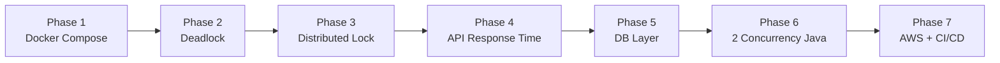
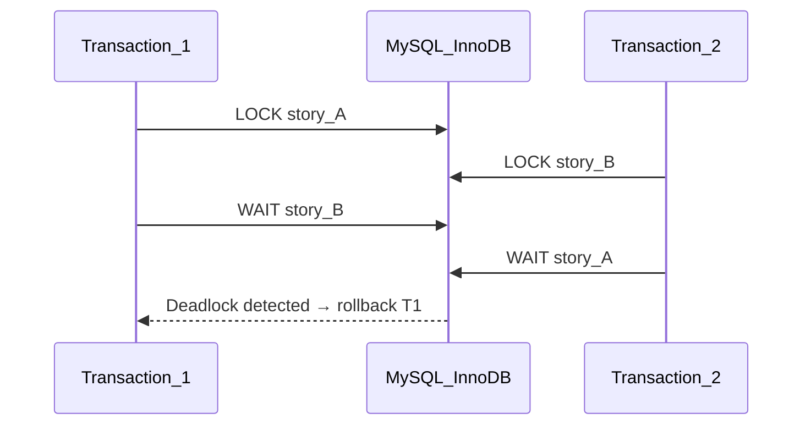
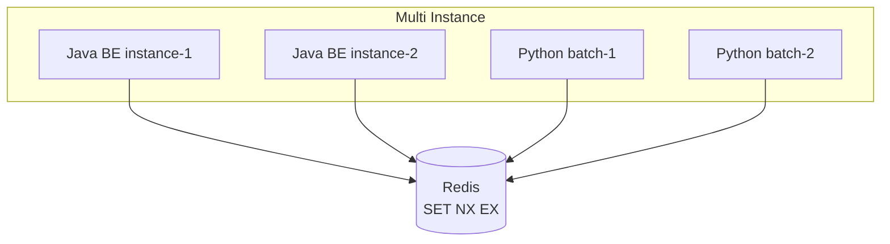

# Plan: Docker → Deadlock → Distributed Lock → API Perf → DB Layer → 2 Concurrency → AWS/CI/CD

## Thứ tự ưu tiên (7 phase)



| Phase | Chủ đề | Mục tiêu | Kết quả đo được |
|---|---|---|---|
| **1** | Docker Compose | Start BE = 1 lệnh | `docker compose up -d` chạy full stack |
| **2** | Deadlock (App + DB) | Hiểu + phòng tránh + retry | Reproduce deadlock, fix lock ordering |
| **3** | Khóa phân tán (Redis) | Abstraction lock dùng chung | `DistributedLockService` hoạt động multi-instance |
| **4** | Giảm API response time | Index, EXPLAIN, pool tuning | p95 latency giảm trên GET endpoints chính |
| **5** | DB layer correctness | N+1, lost update, replica routing | Query count ↓, 409 conflict, slave route đúng |
| **6** | 2 bài concurrency Java | Sprint lock + Single Flight rebuild | Conflict handling + 100 req → 1 rebuild |
| **7** | AWS + GitHub Actions | Production deploy | `https://api.duchuy.com` + auto deploy |

**Frontend:** Chỉ deploy BE. Flutter mobile trỏ API; sau này ReactJS dùng `https://api.duchuy.com/api`.

---

## Hiện trạng codebase

| Vấn đề | Vị trí | Ảnh hưởng |
|---|---|---|
| Chưa có Docker gộp | [`be/nckh/rabbitmq/`](NCKH_1_2025_2026_NGUYEN_HUY_QUAN/be/nckh/rabbitmq/), [`mysql-replication/`](NCKH_1_2025_2026_NGUYEN_HUY_QUAN/be/nckh/mysql-replication/) | Phải start từng service thủ công |
| Deadlock tiềm ẩn | [`SprintAppServiceImpl.addUserStoriesToSprint()`](NCKH_1_2025_2026_NGUYEN_HUY_QUAN/be/nckh/nckh-application/src/main/java/com/xxxx/ddd/application/service/sprint/impl/SprintAppServiceImpl.java) — loop update nhiều story | 2 transaction lock rows theo thứ tự khác nhau → InnoDB deadlock |
| Chưa có distributed lock | [`neo4j_write_lock.py`](NCKH_1_2025_2026_NGUYEN_HUY_QUAN/analyze_user_stories/src/services/neo4j_write_lock.py) dùng FileLock local | Không scale multi-container |
| API chậm tiềm ẩn | N+1 + thiếu index + read không route slave | Response time cao trên list endpoints |
| Lost update | [`UserStory.java`](NCKH_1_2025_2026_NGUYEN_HUY_QUAN/be/nckh/nckh-domain/src/main/java/com/xxxx/dddd/domain/model/entity/UserStory.java) không `@Version` | Last write wins |
| Rebuild storm | [`triggerRebuildGraph()`](NCKH_1_2025_2026_NGUYEN_HUY_QUAN/be/nckh/nckh-application/src/main/java/com/xxxx/ddd/application/service/workspace/impl/WorkspaceAppServiceImpl.java) | 100 request = 100 RabbitMQ message |

---

## Phase 1: Docker Compose — start BE bằng 1 lệnh

*(Giữ nguyên nội dung phase trước — nền tảng cho mọi phase sau)*

### Mục tiêu

```bash
cd docker && docker compose up -d --build
```

### Services

| Service | Image/Build | Command |
|---|---|---|
| `mysql-master`, `mysql-slave` | mysql:8.0 | replication init script |
| `redis`, `rabbitmq`, `neo4j`, `keycloak` | official | - |
| `java-be` | [`be/nckh/Dockerfile`](NCKH_1_2025_2026_NGUYEN_HUY_QUAN/be/nckh/Dockerfile) | `java -jar app.jar` |
| `python-api` | [`analyze_user_stories/Dockerfile`](NCKH_1_2025_2026_NGUYEN_HUY_QUAN/analyze_user_stories/Dockerfile) | `uvicorn main:app` |
| `python-consumer` | same image | `python -m src.messaging.consumer` |
| `python-batch` | same image | `python -m src.messaging.batch_runner` |

### Files tạo mới

```
docker/
├── docker-compose.yml
├── docker-compose.override.yml
├── .env.example
└── init/
    ├── mysql-master-init.sql
    └── mysql-replication.sh
be/nckh/Dockerfile
analyze_user_stories/Dockerfile
```

### Verify

- [ ] `docker compose ps` — all healthy
- [ ] `curl http://localhost:8080/api/actuator/health`
- [ ] Tạo user story → Python consumer xử lý

---

## Phase 2: Deadlock — tầng ứng dụng & tầng DB

> Mục tiêu phase này là **tìm hiểu lý thuyết + reproduce + áp dụng vào project**, không chỉ fix nhanh.

### 2.1 Phân biệt 2 loại deadlock

| Loại | Xảy ra ở đâu | Ví dụ trong project |
|---|---|---|
| **DB Deadlock** | MySQL InnoDB | 2 transaction cùng update `user_story` nhưng lock rows theo thứ tự ngược nhau |
| **App Deadlock** | Java threads | Thread A giữ lock L1 chờ DB; Thread B giữ DB connection chờ L1 (hiếm hơn với Spring) |



### 2.2 Scenario deadlock thực tế trong codebase

**Scenario A — Bulk sprint assign:**

[`SprintAppServiceImpl.addUserStoriesToSprint()`](NCKH_1_2025_2026_NGUYEN_HUY_QUAN/be/nckh/nckh-application/src/main/java/com/xxxx/ddd/application/service/sprint/impl/SprintAppServiceImpl.java):

```java
// User A: assign stories [1, 2, 3]
// User B: assign stories [3, 2, 1]  ← cùng stories, thứ tự ngược
for (UserStory story : stories) {
    assignStoryToSprint(sprint, story);  // UPDATE user_story WHERE us_id=?
}
```

InnoDB lock index records theo thứ tự truy cập → **deadlock**.

**Scenario B — Start sprint + move stories:**

`startSprint()` update sprint status + loop update stories — transaction dài, tăng xác suất conflict.

### 2.3 Cách phát hiện (trên Docker stack Phase 1)

```sql
-- Xem deadlock gần nhất
SHOW ENGINE INNODB STATUS;  -- section LATEST DETECTED DEADLOCK

-- Bật log
SET GLOBAL innodb_print_all_deadlocks = ON;
```

Java: catch `CannotAcquireLockException` / `PessimisticLockingFailureException` (Spring wrap MySQL 1213).

### 2.4 Hướng xử lý

| Giải pháp | Tầng | Áp dụng |
|---|---|---|
| **Lock ordering** | DB | Sort `userStoryIds` trước khi update → mọi transaction lock cùng thứ tự |
| **Transaction ngắn** | App | Không gọi RabbitMQ/external API trong `@Transactional` |
| **Retry on deadlock** | App | `@Retryable` hoặc manual retry max 3 lần khi MySQL error 1213 |
| **Optimistic lock** | DB | `@Version` (Phase 5) — tránh giữ row lock lâu |
| **Pessimistic lock có chủ đích** | DB | `@Lock(PESSIMISTIC_WRITE)` + `ORDER BY id` khi thực sự cần |

**Implement cụ thể:**

1. `SprintAppServiceImpl.addUserStoriesToSprint()`: sort IDs → `TreeSet` trước loop
2. Tạo `DeadlockRetryAspect` hoặc helper retry cho deadlock (error code 1213)
3. Script JMeter: 2 thread bulk assign overlapping stories → verify retry thành công, không 500

### 2.5 So sánh với Lost Update (Phase 5)

| | Deadlock | Lost Update |
|---|---|---|
| Triệu chứng | 500 / rollback, MySQL 1213 | Im lặng ghi đè, data sai |
| Fix chính | Lock ordering + retry | `@Version` optimistic lock |
| Quan hệ | Pessimistic lock lâu → tăng deadlock | Optimistic lock → giảm deadlock |

### Verify Phase 2

- [ ] Reproduce deadlock bằng concurrent test
- [ ] Sau fix lock ordering: không còn deadlock
- [ ] Retry handler hoạt động khi vẫn xảy ra edge case
- [ ] Document `SHOW ENGINE INNODB STATUS` output mẫu

---

## Phase 3: Khóa phân tán (Distributed Lock)

> Xây **infrastructure lock** dùng chung; Phase 6 sẽ apply vào graph rebuild.

### 3.1 Tại sao cần (vs lock local)

| Lock local | Distributed lock (Redis) |
|---|---|
| `synchronized`, `ReentrantLock`, Python FileLock | Redis `SET key NX EX ttl` |
| Chỉ trong 1 JVM / 1 container | Nhiều Java instance + Python container |
| Docker scale 2 `python-batch` → 2 rebuild song song | Chỉ 1 holder trên toàn cluster |

### 3.2 Kiến trúc



### 3.3 Implement Java — `DistributedLockService`

Tạo `nckh-infrastructure/.../lock/DistributedLockService.java`:

**Option A (khuyến nghị):** Spring Data Redis + Lua script unlock an toàn

```java
public interface DistributedLockService {
    Optional<String> tryLock(String key, Duration ttl);
    void unlock(String key, String token);
    <T> T executeWithLock(String key, Duration ttl, Supplier<T> action);
}
```

- Key pattern: `lock:{domain}:{resourceId}` (vd: `lock:graph:rebuild:{workspaceId}`)
- Token: UUID per acquire — chỉ holder mới unlock được (tránh xóa lock của process khác)
- TTL bắt buộc — auto-release khi process crash

**Option B:** Redisson `RLock` (nếu muốn reentrant, watchdog auto-renew)

### 3.4 Implement Python — đồng bộ key pattern

Sửa [`neo4j_write_lock.py`](NCKH_1_2025_2026_NGUYEN_HUY_QUAN/analyze_user_stories/src/services/neo4j_write_lock.py):

- FileLock → `redis.lock(name, timeout=300)` (redis-py)
- Cùng key prefix với Java: `lock:graph:write:{workspaceId}`

### 3.5 Pitfalls cần hiểu

| Vấn đề | Giải pháp |
|---|---|
| Lock hết TTL giữa chừng | TTL > thời gian job max; watchdog renew (Redisson) |
| Unlock nhầm lock của process khác | Unlock bằng Lua script check token |
| Redis single point of failure | Dev: 1 Redis; Prod: Redis Sentinel/Cluster (Phase 7) |
| Deadlock app giữ Redis lock + chờ DB | Giữ critical section ngắn; không I/O nặng trong lock |

### Verify Phase 3

- [ ] 2 Java instance cùng `tryLock("test")` → chỉ 1 thành công
- [ ] TTL hết → lock tự release
- [ ] Python + Java dùng cùng key → mutual exclusion cross-language
- [ ] Unit test unlock với wrong token → lock không bị xóa

---

## Phase 4: Giảm API Response Time

> Tập trung **đo → phân tích → tối ưu** trước khi fix correctness (Phase 5). Nhiều kỹ thuật overlap với Phase 5 nhưng góc nhìn khác: **latency/throughput**.

### 4.1 Baseline — đo trước khi fix

Thêm dependency:

```xml
spring-boot-starter-actuator
micrometer-registry-prometheus  <!-- optional -->
```

Endpoints cần benchmark:

| API | Endpoint | Lý do chậm tiềm ẩn |
|---|---|---|
| List backlog | `GET .../backlog/{workspaceId}` | N+1 (fix Phase 5) |
| List sprint stories | `GET .../sprint/{id}/stories` | N+1 |
| List workspace members | `GET .../workspace/{id}/members` | N+1 + no transaction |
| List sprints | `GET .../sprint?workspaceId=` | OK nhưng cần baseline |

Tool: `curl -w "%{time_total}"`, Apache Bench, hoặc k6 script.

Ghi lại: **p50, p95, p99 latency** + query count (Hibernate statistics).

### 4.2 Index — tầng DB (quick win)

Migration SQL (áp dụng sớm, không cần đợi Phase 5):

```sql
CREATE INDEX idx_user_story_workspace_sprint ON user_story(wsp_id, spr_id);
CREATE INDEX idx_user_story_sprint ON user_story(spr_id);
CREATE INDEX idx_user_story_backlog ON user_story(backlog_id);
CREATE INDEX idx_workspace_member_workspace ON workspace_member(wsp_id);
CREATE INDEX idx_sprint_workspace ON sprint(wsp_id);
```

Verify:

```sql
EXPLAIN SELECT * FROM user_story WHERE wsp_id = ? AND spr_id IS NULL;
-- Expect: type=ref, key=idx_user_story_workspace_sprint
```

### 4.3 Connection pool — HikariCP

[`application.yml`](NCKH_1_2025_2026_NGUYEN_HUY_QUAN/be/nckh/nckh-start/src/main/resources/application.yml) đã có Hikari config — review:

```yaml
spring.datasource.hikari:
  maximum-pool-size: 10      # dev; prod: 20-30 tùy EC2
  connection-timeout: 30000
  leak-detection-threshold: 60000  # dev: phát hiện connection leak
```

### 4.4 Read replica cho GET (giảm tải master)

Route read-only queries sang slave → master rảnh cho write → write latency giảm.

- Chuẩn bị: fix [`DataSourceAspect`](NCKH_1_2025_2026_NGUYEN_HUY_QUAN/be/nckh/nckh-infrastructure/src/main/java/com/xxxx/ddd/infrastructure/config/datasource/DataSourceAspect.java) intercept `@Transactional(readOnly=true)` (hoàn thiện Phase 5)
- Phase 4: thêm `@ReadOnly` vào các GET endpoint chính + đo latency trước/sau

### 4.5 Các tối ưu bổ sung

| Kỹ thuật | Impact | Phase |
|---|---|---|
| JOIN FETCH (N+1 fix) | Cao | Phase 5 |
| Index | Cao | **Phase 4** |
| Pagination (`Pageable`) | Trung bình | Phase 4 nếu list lớn |
| `@Transactional(readOnly=true)` | Trung bình | Phase 4-5 |
| Redis cache hot data | Trung bình | Optional, Phase 6+ |
| Không log SQL prod | Nhỏ | Phase 4 (`show-sql: false`) |

### 4.6 Slow query monitoring (Docker)

```yaml
# mysql-master command
command: --slow-query-log=1 --long-query-time=1
```

### Verify Phase 4

- [ ] Baseline p95 documented cho 4 GET endpoints
- [ ] `EXPLAIN` dùng index (không full table scan)
- [ ] Sau index: p95 giảm đo được (kỳ vọng 20-50% trên indexed queries)
- [ ] Hikari metrics qua actuator (`/actuator/metrics/hikaricp.connections.active`)

---

## Phase 5: DB Layer — N+1, Lost Update, Read Replica

*(Nội dung correctness — bổ sung cho Phase 4)*

### 5.1 N+1 Query

[`UserStoryJpaMapper`](NCKH_1_2025_2026_NGUYEN_HUY_QUAN/be/nckh/nckh-infrastructure/src/main/java/com/xxxx/ddd/infrastructure/persistence/mapper/UserStoryJpaMapper.java) — thêm JOIN FETCH:

```java
@Query("""
    SELECT DISTINCT us FROM UserStory us
    LEFT JOIN FETCH us.sprint
    LEFT JOIN FETCH us.workspace
    LEFT JOIN FETCH us.backlog
    WHERE us.workspace.id = :workspaceId AND us.sprint IS NULL
""")
List<UserStory> findBacklogWithRelations(@Param("workspaceId") String workspaceId);
```

Tương tự: `findBySprint_Id`, `WorkspaceMember` fetch profile + role.

**Kỳ vọng:** 50 stories: ~151 queries → **1 query**; p95 latency giảm mạnh (đo lại Phase 4 metrics).

### 5.2 Lost Update — `@Version`

```sql
ALTER TABLE user_story ADD COLUMN us_version BIGINT NOT NULL DEFAULT 0;
```

[`UserStory.java`](NCKH_1_2025_2026_NGUYEN_HUY_QUAN/be/nckh/nckh-domain/src/main/java/com/xxxx/dddd/domain/model/entity/UserStory.java):

```java
@Version
@Column(name = "us_version")
Long version;
```

[`SprintAppServiceImpl`](NCKH_1_2025_2026_NGUYEN_HUY_QUAN/be/nckh/nckh-application/src/main/java/com/xxxx/ddd/application/service/sprint/impl/SprintAppServiceImpl.java): catch `OptimisticLockException` → `409 CONFLICT`.

### 5.3 Read Replica Routing

Fix `DataSourceAspect` → intercept `@Transactional(readOnly = true)`.

Read-after-write: sau create/update, force master cho read trong cùng request.

### 5.4 Transaction Boundary

[`getMembers()`](NCKH_1_2025_2026_NGUYEN_HUY_QUAN/be/nckh/nckh-application/src/main/java/com/xxxx/ddd/application/service/workspace/impl/WorkspaceAppServiceImpl.java): thêm `@ReadOnly` + `@Transactional(readOnly = true)`.

### Verify Phase 5

- [ ] Hibernate statistics: 1 query cho list backlog
- [ ] Concurrent assign → 409 conflict
- [ ] Read route slave (MySQL log)
- [ ] Re-measure p95 vs Phase 4 baseline — document improvement

---

## Phase 6: 2 bài Concurrency Java

### Lý do chọn

| # | Bài toán | Dựa trên phase trước |
|---|---|---|
| **1** | **Optimistic Lock — Concurrent Sprint Planning** | `@Version` Phase 5 + deadlock retry Phase 2 |
| **2** | **Single Flight — Graph Rebuild** | `DistributedLockService` Phase 3 |

### Concurrency #1: Concurrent Sprint Planning

- Client gửi `expectedVersion`
- Global handler `409 CONFLICT` + trả state hiện tại
- Benchmark: 2 thread assign cùng story

### Concurrency #2: Single Flight Graph Rebuild

[`GraphRebuildCoordinator`](NCKH_1_2025_2026_NGUYEN_HUY_QUAN/be/nckh/nckh-application/src/main/java/com/xxxx/ddd/application/service/workspace/impl/WorkspaceAppServiceImpl.java) thay `triggerRebuildGraph()`:

```java
// In-process coalesce
ConcurrentHashMap<String, CompletableFuture<Void>> inFlight;

// Cross-instance exclusion
distributedLock.executeWithLock("lock:graph:rebuild:" + workspaceId, TTL_5MIN, () -> {
    debounce(workspaceId, 3s);
    graphEventPort.sendRebuildEvent(workspaceId);
});
```

Python [`batch_runner.py`](NCKH_1_2025_2026_NGUYEN_HUY_QUAN/analyze_user_stories/src/messaging/batch_runner.py) acquire cùng Redis key trước `rebuild_workspace()`.

### Verify Phase 6

- [ ] Sprint conflict → 409 + fresh data
- [ ] 100 rebuild req → 1 RabbitMQ message
- [ ] Scale 2 batch container → 1 rebuild (Redis lock)

---

## Phase 7: Deploy AWS EC2 + GitHub Actions CI/CD

> **Cuối cùng** — sau khi Phase 1-6 ổn local/Docker.

Theo [`deploy-aws-ec2-guide.md`](NCKH_1_2025_2026_NGUYEN_HUY_QUAN/deploy-aws-ec2-guide.md):

| Resource | Spec |
|---|---|
| EC2 | t3.large (8GB) |
| Domain | `api.duchuy.com`, `py.duchuy.com`, `auth.duchuy.com` |
| Nginx + Certbot SSL | Bind container localhost-only |

**GitHub Actions:** push `main` → SSH EC2 → `docker compose up -d --build` → health check.

**Flutter:** `BASE_URL=https://api.duchuy.com/api`

### Verify Phase 7

- [ ] HTTPS API live
- [ ] CI/CD auto deploy
- [ ] Mobile app connect production

---

## Timeline đề xuất (8 tuần)

| Tuần | Phase | Deliverable |
|---|---|---|
| 1 | Phase 1 | Docker Compose full stack |
| 2 | Phase 2 | Deadlock reproduce + lock ordering + retry |
| 3 | Phase 3 | DistributedLockService Java + Python Redis lock |
| 4 | Phase 4 | Index + baseline metrics + p95 improvement |
| 5 | Phase 5 | N+1 fix, @Version, read replica |
| 6 | Phase 6 | 2 bài concurrency Java |
| 7-8 | Phase 7 | EC2 + Nginx + SSL + GitHub Actions |

---

## Quan hệ giữa các phase

```mermaid
flowchart TB
    Docker[Phase 1 Docker] --> Deadlock[Phase 2 Deadlock]
    Deadlock --> DistLock[Phase 3 Distributed Lock]
    DistLock --> Perf[Phase 4 API Perf\nindex + metrics]
    Perf --> DBLayer[Phase 5 DB Layer\nN+1 + Version]
    DBLayer --> CCY[Phase 6 Concurrency\nOptimistic + SingleFlight]
    CCY --> Deploy[Phase 7 AWS CI/CD]

    Deadlock -.->|lock ordering| DBLayer
    DistLock -.->|Redis lock| CCY
    Perf -.->|index early win| DBLayer
    DBLayer -.->|@Version| CCY
```

---

## Files chính sẽ tạo/sửa

| Phase | Files |
|---|---|
| 1 | `docker/docker-compose.yml`, `be/nckh/Dockerfile`, `analyze_user_stories/Dockerfile` |
| 2 | `SprintAppServiceImpl.java`, `DeadlockRetryAspect.java`, test/benchmark script |
| 3 | `DistributedLockService.java`, `RedisDistributedLockConfig.java`, `neo4j_write_lock.py` |
| 4 | Migration index SQL, `application-dev.yml` metrics, k6/ab script |
| 5 | `UserStoryJpaMapper.java`, `UserStory.java`, `DataSourceAspect.java` |
| 6 | `GraphRebuildCoordinator.java`, `WorkspaceAppServiceImpl.java`, `GlobalExceptionHandler.java` |
| 7 | `.github/workflows/deploy-ec2.yml`, `docker-compose.prod.yml` |

---

## Rủi ro & mitigations

| Rủi ro | Mitigation |
|---|---|
| Deadlock retry loop vô hạn | Max 3 retries + exponential backoff |
| Redis lock TTL quá ngắn | TTL > max rebuild time; watchdog |
| Index thừa làm chậm write | Chỉ index columns trong WHERE/JOIN thực tế |
| Phase 4 vs 5 overlap | Phase 4 = index + đo; Phase 5 = N+1 + correctness |
| Deploy sớm | Phase 7 **bắt buộc cuối cùng** |
